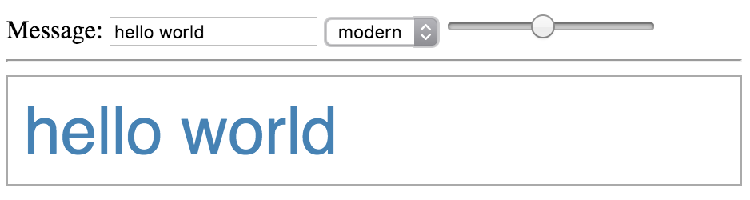

 Angular Editor
====

## Description

Create a message editor using Angular that allows a text for a message to be entered and offers controls to style the message.

## Requirements

* You can either use a set of classes, or directly change the inline element style. If you use classes, offer at
least one inline style option.

* Use at least one repeating construct, either `ng-repeat` or `ng-options`, to control dropdown, radio buttons or checkboxes

## Example

## Rubric

* Meets Requirements: 5pts
* Works Correctly: 5pts
